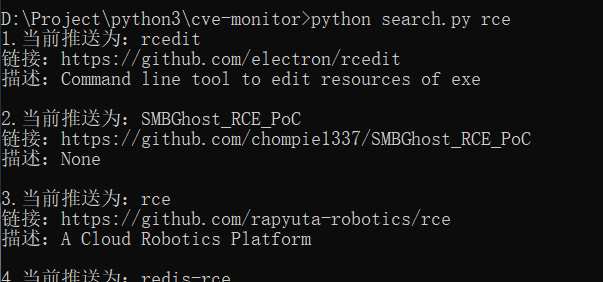
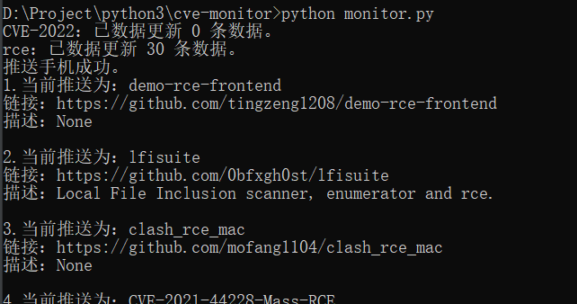

# cve-monitor
利用 github 提供的搜索 api 和 Server酱的提供推送 api 监控 CVE。

## 准备
在 [Server酱](https://sct.ftqq.com/) 申请一个 send key。

## 安装
要求：python 3x。
```
pip3 install -r requirement.txt
```

## 使用
### search.py
CVE 搜索脚本。
一次搜索返回10条数据，可以选择继续搜索或提出搜索。
```
> python search.py -h
usage: main.py <搜索的关键词>
```


### monitor.py
CVE 监控脚本。
每次运行该脚本都会将抓取的数据保存的与关键词同名的 csv 文件中。

用编辑器打开脚本设置参数：
```
......
# 要监控的关键词，多个关键词以半角逗号分隔
# auto 会被解释为最新的 CVE 类型，如今年是2022年，auto 将被解释为 CVE-2022
search_key = "auto,rce"
# Server酱的 send key（在 https://sct.ftqq.com/ 获取）
send_key = "SCT63558ToWsvMZ0vUbc76WIhc5Dz7JOZ"
# 打印详细的信息
print_detail_enter = True
# 推送详细的信息
push_detail_enter = False
......
```


你应该建立一个内容大概如下的 .bat 文件：
```
python [monitor.py 的完整路径]
```
并放到 Windows 系统的启动路径（C:\ProgramData\Microsoft\Windows\Start Menu\Programs\StartUp）以确保系统每次启动时能够自动运行该脚本，以及时获取最新消息。